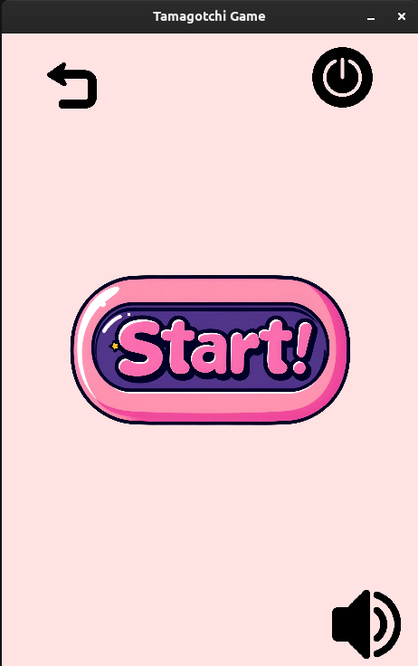
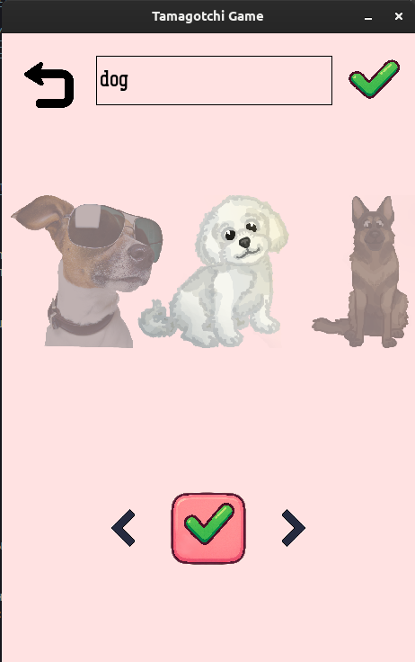
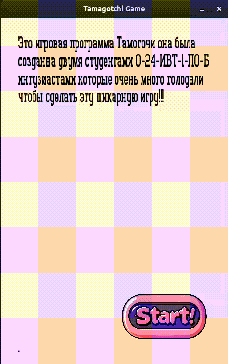

# 🐣 Tamagotchi_SDL2


> Ретро-игра в стиле Тамагочи, созданная на C с использованием библиотеки SDL2 (SDL_image, SDL_ttf, SDL_mixer, SDL_gfx).

---

## 🎮 Скриншоты

| Меню игры | Меню питомца | Геймплей  |
|:--:|:--:|:--:|
|  |  |  |


## 📝 Цель
**Создать полноценную копию игры Tamagotchi отвечающую требованиям:**
- 👶 Возможность ухаживать за виртуальным питомцем и окончания игры за не соблюдением должной заботы.

- ⏳ Изменение параметров со временем.

- 📳 **Уведомления** о состояниях питомца.  

- 📽️ Наличие приятных анимаций.  

- 🎨 Выбор внешнего вида питомца и функция смены имени.

- 🎵 Наличие музыки и звуковых эффектов.

- 📚 Наличие нескольких сохранений. 

- ☢️ Кроссплатформенность.

---

## 📁 Структура проекта
```
Tamagotchi_SDL2/
├── src/                    # Исходники игры (C/SDL2)
├── assets/                 # Спрайты, музыка и т.п.
├── include/                # Заголовки
├── reports/                # Документы проекта
├── LICENSE
├── Makefile                # Компиляция через make
├── README.md
└── .gitignore
```

## 📚 Курсовой проект

Данный проект изначально создавался как курсовая работа по программированию вместе с моим товарищем.

📄 Ознакомиться можно в папке [`/reports`](./reports):

- [Курсовая работа (PDF)](./reports/Explanatory_Note.pdf)
- [Презентация для защиты (PDF)](./reports/Presentation.pdf)
- [Доклад к презентации (PDF)](./reports/report_for_presentation.pdf)

<details>
  <summary>Полученная оценка</summary>

    5 (Отлично) 
</details>

## 🧠 Чему я научился

В процессе разработки этого проекта я прокачал как технические, так и **архитектурные** навыки:

| Навык | Описание |
|------|----------|
| 🧱 **Работа с SDL2** | Инициализация, рендеринг, управление окнами и текстурами, кроссплатформенные методы, анимации все на низкоуровневом коде, который позволяет контроллировать всем в проекте |
| 🧠 **Управление памятью** | Работа с указателями, освобождение ресурсов, отладка утечек с использованием LLDB|
| 🎮 **Game Loop** | Разделение логики обновления, обработки событий и отрисовки, создания объекта сцен с наследованием для скорости разработки и читаемости кода |
| 🧩 **Менеджмент состояний** | Переключение между экранами: меню, игра, пауза, завершение |
| 🎨 **Обработка пользовательского ввода** | Клавиатура, мышь, тачскрин в SDL2 |
| ⏱ **Таймеры и кадровая синхронизация** | Произвольный FPS в игре (счет времени также присутствует для всех платформ) |
| 🖼 **Загрузка и отображение графики** | Работа с изображениями и спрайтами, загрузка их на разных устройствах (Android включительно) |
| **📨 Уведомления в системах**| Linux -- libnotify (работает на wayland), Android -- кастомный JavaActivity который подключен через SDL совместимость|
| **👥 Работа в команде** | Получен опыт работы в команде (ветка dev, мердж веток в одну) |

> 📎 Дополнительно — получил практику в оформлении курсовых и презентаций, которые теперь адаптированы под открытый pet-проект.


# ⚙️ Компиляция

**Компилятор для работы игровой программы: gcc или clang и SDL2, а также SDL_image SDL_mixer, SDL_ttf, SDL_gfx**

## Makefile
Вполните команду в корне проекта:
```
$ make
```

## Windows + VScode: 
**Для работы требуется MinGv-w64 совместно с MSYS2**
(Для SDL2 также добавьте все остальные модули)
<details>
  <summary>tasks.json</summary>

    {
        "version": "2.0.0",
        "tasks": [
        {
            "label": "Build Tamagotchi Game",
            "type": "shell",
            "command": "C:\\msys64\\mingw64\\bin\\gcc.exe",
            "args": [
            "-fdiagnostics-color=always",
            "-g",
            "src/*",
            "-o",
            "${workspaceFolder}\\game.exe",
            "-I", "${workspaceFolder}\\include",
            "-I", "C:\\msys64\\mingw64\\include\\SDL2",
            "-L", "C:\\msys64\\mingw64\\lib",
            "-lmingw32",
            "-lSDL2main",
            "-lSDL2",
            "-lSDL2_image",   
            "-lSDL2_gfx",  
            "-lpng16", 
            "-lz", 
            "-ljpeg"     
            ],
            "options": {
            "cwd": "${workspaceFolder}"
            },
            "problemMatcher": ["$gcc"],
            "group": {
            "kind": "build",
            "isDefault": true
            }
        }
        ]
    }            
</details>

<details>
  <summary>c_cpp_properties.json</summary>

    {
        "configurations": [
        {
            "name": "Win32",
            "includePath": [
                "${workspaceFolder}/**",
                "C:/msys64/mingw64/include",
                "C:/msys64/mingw64/include/SDL2"                
            ],
            "defines": [
                "_DEBUG",
                "UNICODE",
                "_UNICODE"
            ],
            "windowsSdkVersion": "10.0.19041.0",
            "compilerPath": "cl.exe",
            "cStandard": "c17",
            "cppStandard": "c++17",
            "intelliSenseMode": "windows-msvc-x64"
        }
    ],
        "version": 4
    }
</details>

## Linux + VScode

<details>
  <summary>tasks.json</summary>
  
    {
      "version": "2.0.0",
      "tasks": [
        {
          "label": "Build with Bear + clangd",
          "type": "shell",
          "command": "bash",
          "args": [
            "-lc",
            "bear -- gcc -fdiagnostics-color=always -g \
            $(pkg-config --cflags libnotify glib-2.0 sdl2 SDL2_image SDL2_gfx SDL2_ttf SDL2_mixer) \
            src/main.c src/graphics.c src/scene_manager.c src/menu_scene.c src/file_manager.c\
            src/game_scene.c src/menu_pet.c src/dead_scene.c src/title_scene.c src/text_input.c src/saves_scene.c\
            src/ui.c src/pet.c src/animation.c src/notify.c\
            -o ${workspaceFolder}/game \
            -I${workspaceFolder}/include \
            $(pkg-config --libs libnotify glib-2.0 sdl2 SDL2_image SDL2_gfx SDL2_ttf SDL2_mixer)"
          ],
          "options": {
            "cwd": "${workspaceFolder}"
          },
          "group": {
            "kind": "build",
            "isDefault": true
          }
        }
      ]
    }
</details>


<details>
  <summary>launch.json </summary>

    {
      "version": "0.2.0",
      "configurations": [
        {
          "name": "Debug with LLDB",
          "type": "lldb",          // Используем тип 'lldb' вместо 'cppdbg'
          "request": "launch",
          "program": "game",
          "args": [],
          "cwd": "${workspaceFolder}",
          "preLaunchTask": "Build with Clang",
          "environment": [],
          "externalConsole": false
        }
      ]
    }
  </details>

+ LLDB plugin in VScode for debug    